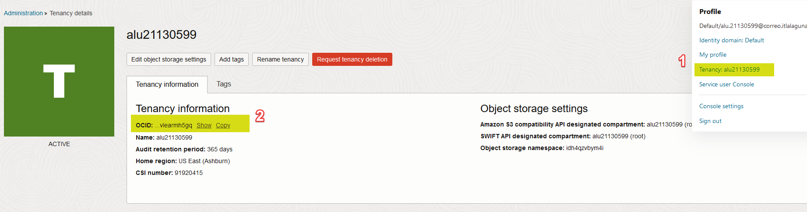
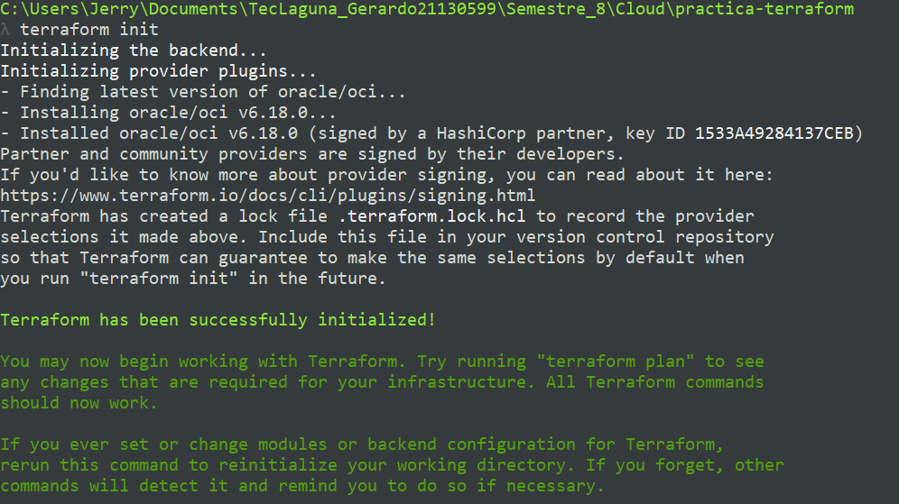

Para obtener nuestro OCID


1. Inicializamos el directerio con
   
   ```
   terraform init 


1. Formateamos

   ```
    terraform fmt  
1. Validamos

   ```
    terraform validate
1. Creamos la infrastructura
    ```
    terraform apply
1. Podemos inspeccionar el estado con
   ```
   terraform show
1. Y listar el estado con
   ```
   terraform state list

### Parte 2 - Variables
1. Creacion de variables.tf y terraform.tfvars

### Parte 3 - Change
Creacion de nuevos recursos y modificacion
1. Crear una subred, una instancia y un volumen
2. Modificar y aplicar
3. Para crear instancia es necesario generar llaves privada y publica
    ```
    ssh-keygen -t rsa -N "" -b 2048 -C <nombre-de-la-llave> -f <nombre-de-la-llave>
### Parte 4 - Destroy 
```
terraform destroy